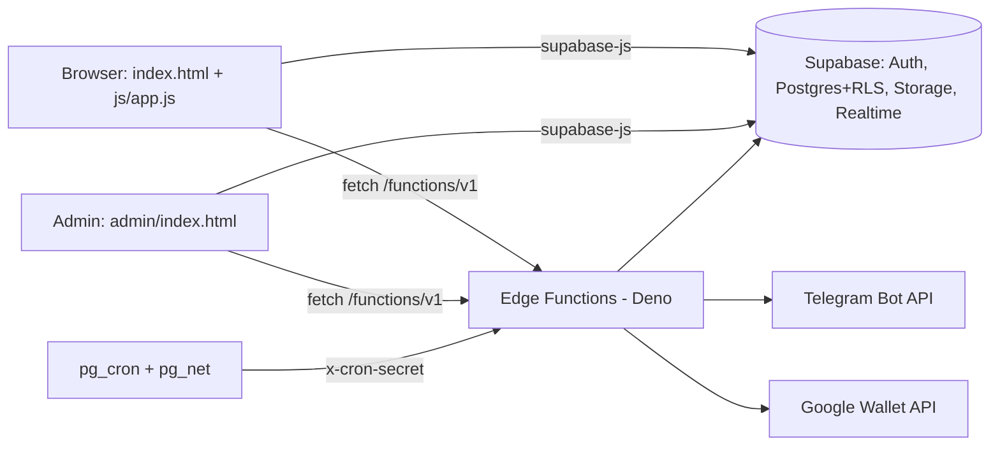

# CodeUp

**Learn • Build • Grow**

CodeUp is an Arabic-first (RTL) learning platform for programming students. It combines multi-course learning management (lessons, assignments, reviewed submissions, XP and leaderboards), student groups, a university materials archive backed by Telegram, a Technical Week events system, a student Marketplace, a Google Wallet membership card, and a community feed with direct messages.

> **Status vocabulary** used across all docs: **Implemented** (code exists) · **Tested** (automated tests passed, see [TESTING](docs/TESTING.md)) · **Deployment verified** (deployed version confirmed) · **Partial** · **Planned** · **Unknown**. These are not interchangeable. The live Supabase project was inspected read-only on 2026-10-10: database objects and all nine Edge Functions exist and are active. End-to-end behavior was not exercised.

## What it does

| Area | Summary | Status |
|---|---|---|
| Courses & learning | Courses → units → lessons, learning resources with roles, assignments, submissions, grades, XP/streak/progress, per-course leaderboard, learning tracks | Implemented |
| Groups ("squads") | Join requests, leader applications, leader hand-over, leave, per-leader permissions | Implemented |
| University | University → program → year → semester → subject → materials; Telegram archive per year | Implemented |
| Telegram archive & import | Upload to Telegram, link posts, import message ranges, ownership tracking, cleanup | Implemented, edge logic Tested (mocked) |
| Technical Week | Events, individual and team registration, team leaders, announcements | Implemented (some limits not enforced, see [FEATURES](docs/FEATURES.md)) |
| Marketplace | Classified listings (sale, exchange, borrow, free), requests, WhatsApp/Telegram contact, admin review | Implemented; database objects exist live but are not in the repo |
| Membership card | Google Wallet pass via Edge Function | Partial: QR target page not in repo |
| Community | Ranked feed, comments, reactions, notifications, realtime DMs | Implemented (database layer for posts/messages not in repo) |
| Quizzes, certificates, voice notes, DM attachments, language switcher | Not present in the code | Not implemented |

## Architecture at a glance



Details: [docs/ARCHITECTURE.md](docs/ARCHITECTURE.md).

## Technology stack (verified from the repository)

- Frontend: plain HTML/CSS/JavaScript, no build step, no `package.json`. `@supabase/supabase-js` from jsDelivr: pinned `2.81.1` in `index.html`, floating `@2` in `admin/index.html`.
- Backend: Supabase (Postgres, RLS, Storage buckets `submissions`, `avatars`, `course-assets`, Realtime), `pg_cron`, `pg_net`.
- Edge Functions: Deno/TypeScript, `jsr:@supabase/supabase-js@2`.
- Integrations: Telegram Bot API, Google Wallet API, Google/GitHub OAuth through Supabase Auth.
- Hosting: a `CNAME` file and `CHANGELOG_v2.md` indicate GitHub Pages with a custom domain. Not verified live.

## Project structure

```
index.html, js/            Student app (js/app.js is a large single-file app; js/shared.js helpers)
admin/                     Admin panel (index.html, css/, js/ modules per section)
supabase/functions/        9 Edge Functions
database/                  SQL schema + numbered patches (see DATABASE.md caveats)
tests/edge/                Node tests for Edge Functions (mock harness)
privacy.html, terms.html   Legal pages
CodeUp-main/               OLDER SNAPSHOT of the project (stale, see below)
```

> **Warning:** the nested `CodeUp-main/` folder is an outdated copy (it lacks patches 48–66 and several admin modules). Treat the repository root as the source of truth and consider deleting the copy.

## Getting started

Prerequisites: a Supabase project, a static file server, Node 18+ (only for tests), and optionally the Supabase CLI.

1. Configure `js/supabase.js` with your project URL and **anon** key (never a service-role key).
2. Prepare the database. **Read [docs/DATABASE.md](docs/DATABASE.md) first:** the SQL files do not create every table the code uses, so a fresh project cannot be fully recreated from this repository alone.
3. Serve the repository root with any static server and open `index.html`.
4. Run the Edge Function tests: `node tests/edge/cleanup.test.mjs` (and the other three files).

Full guides: [Development](docs/DEVELOPMENT.md) · [Deployment](docs/DEPLOYMENT.md) · [.env.example](.env.example).

## Documentation

[docs/README.md](docs/README.md) is the index. Main documents: [Architecture](docs/ARCHITECTURE.md), [Features](docs/FEATURES.md), [Database](docs/DATABASE.md), [Authentication & Permissions](docs/AUTHENTICATION-AND-PERMISSIONS.md), [Integrations](docs/INTEGRATIONS.md), [Security](docs/SECURITY.md), [Testing](docs/TESTING.md), [Contributing](CONTRIBUTING.md).

## Known limitations (summary)

- `database/` is not a complete schema: many migrations were applied directly to the live project and have no file here ([docs/PRODUCTION-DIFFERENCES.md](docs/PRODUCTION-DIFFERENCES.md)).
- Patch 66's header says it is unapplied; the live database already has it.
- Tech Week individual `capacity` is not enforced in production; `database/2026_patch_67_*` fixes this but is **not applied**.
- Any signed-in user can pin their own post or label it as an admin announcement (confirmed from definitions, not exploited); `database/2026_patch_68_*` fixes this but is **not applied**. `database/2026_patch_69_*` removes the duplicate archive cron job (also not applied).
- `archive-student-files` is fixed in the repo (fails closed, redacts secrets) but **not deployed**. A duplicate cron job calls it with a stale secret.
- The Wallet QR points to `/verify?m=…`; no such page exists in the repository.
- No frontend tests, CI, or license file. Decisions and rollout order: [docs/ROLLOUT-PLAN.md](docs/ROLLOUT-PLAN.md).

## Project links

Repository (as given by the maintainer, not verified): https://github.com/muayad-babikeir/CodeUp. Custom domain configured in `CNAME`: `codeupsd.online` (not verified live). No license file was found; add one before accepting outside contributions.
