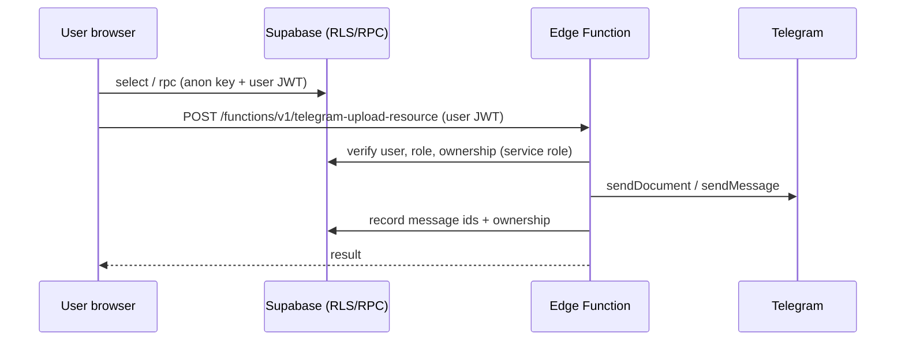

# Architecture

## Components

| Component | Location | Notes |
|---|---|---|
| Student app | `index.html`, `js/app.js`, `js/shared.js`, `js/supabase.js` | Single-page app, hash routing, no build step. `js/app.js` is one large file. |
| Admin panel | `admin/index.html`, `admin/js/*.js`, `admin/css/` | Separate page, sections shown according to the signed-in user's roles. |
| Database | `database/*.sql` | Postgres with RLS and `SECURITY DEFINER` RPCs. See [DATABASE](DATABASE.md) for gaps. |
| Edge Functions | `supabase/functions/*` (9) | Deno. Telegram, Wallet and account deletion. See [INTEGRATIONS](INTEGRATIONS.md). |
| Storage | Buckets `avatars`, `course-assets`, `submissions` | Referenced by client code; bucket policies appear in some patches. |
| Scheduling | `pg_cron` + `pg_net` | Jobs defined in patches 31, 53, 60, 63; they call Edge Functions with an `x-cron-secret` header. |

## Data flow

Reads and most writes go straight from the browser to Postgres under RLS. Operations that need a secret or an external API (Telegram, Wallet, account deletion) go through Edge Functions, which verify the caller's JWT and then use the service role.

## Client structure

- Routing: `App.go({name, ...})` with hash routes; `render()` switches on the view name.
- Views found in `js/app.js`: home (feed, courses, university, Technical Week, Marketplace tabs), course (tabbed), lesson, assignment, submission, profile, messages, notifications, marketplace listing/create, Technical Week event.
- Feature flags: Technical Week (`tech_week_settings`) and Marketplace (`marketplace_enabled`) can be switched off; the matching tabs are then hidden.
- `js/shared.js` holds `loadMyContext` (role resolution), the RPC wrappers, upload helpers and notification helpers.
- Realtime: Supabase channels for notifications and per-conversation messages.

## Scheduled work

| Job | Schedule (from SQL) | Defined in | Target |
|---|---|---|---|
| Student file archiving to Telegram | daily 02:00 UTC | patch 31 | `archive-student-files` |
| Team topic deletion queue (`codeup-topic-cleanup`) | every 5 min | patch 53 | `telegram-team-topic` |
| Resource message cleanup (`codeup-resource-cleanup`) | every 5 min | patch 60 | `telegram-resource-cleanup` |
| Telegram import ticks (`codeup-telegram-import`) | every minute | patch 63 | `telegram-import` |

Live `cron.job` (read-only check, 2026-10-10) shows six active jobs: the four above, plus `cleanup-old-messages` (daily 03:00 UTC) and a **duplicate** archive job (`daily-archive-student-files`, also 02:00 UTC) next to `codeup-archive-student-files-daily`. The duplicate (job 1) uses a different secret and returns 401 each night, so it is redundant; see [PRODUCTION-DIFFERENCES](PRODUCTION-DIFFERENCES.md) and [ROLLOUT-PLAN](ROLLOUT-PLAN.md).

The SQL hardcodes the maintainer's production function URLs and uses a placeholder for the cron secret; adapt both before reuse.
